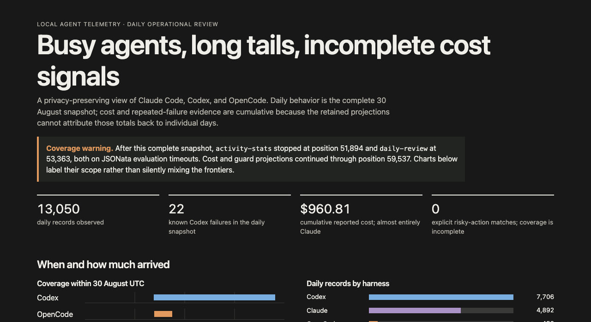

# Tailapps

Tailapps turns local agent telemetry into queryable SQLite datasets. Send
Claude Code, Codex, OpenCode, or Pi telemetry to one local resident, then use
SQL over CLI or MCP to inspect activity, cost, performance, coverage, and
suspicious behavior. Each Tailapp retains useful results rather than another
copy of the OTLP stream.


## What you can install

There are five built-in bundles:

| Tailapp | Questions it answers |
| --- | --- |
| [`daily-review`](tailapps/daily-review/README.md) | What happened today? How many records, failures, slow operations, tokens, reported costs, risky actions, or sensitive fields were observed per harness? |
| [`activity-stats`](tailapps/activity-stats/README.md) | Which tools and endpoints are used? What are the request volumes, latency buckets, outcome rates, token totals, and cache rates? |
| [`agent-guard`](tailapps/agent-guard/README.md) | When did telemetry show an out-of-bounds action, repeated failures, repeated actions, no progress, or missing evidence needed to decide? Findings and coverage are time-anchored. |
| [`session-cost`](tailapps/session-cost/README.md) | How many input, cached, output, and reasoning tokens—and how much reported cost—has each session accumulated? |
| [`signal-counts`](tailapps/signal-counts/README.md) | Are logs, spans, and metric points arriving from each source, and which event names are present? |

Agents and people can easily build new tailapps or customize these included
bundles.

## What the results look like

`daily-review` materializes one row per UTC day and harness. Summarize the
latest captured day with:

```sh
./tailapp query --sql '
  SELECT harness, record_count, failure_count,
         duration_gt_5000ms_count AS slow_events,
         cost_microusd / 1000000.0 AS cost_usd,
         risky_action_count
  FROM daily_review
  WHERE day_utc = (SELECT MAX(day_utc) FROM daily_review)
  ORDER BY harness' daily-review
```

| Harness | Records | Failures | Slow events | Reported cost | Risky actions |
| --- | ---: | ---: | ---: | ---: | ---: |
| claude-code | 4,301 | 0 | 8 | $0.84 | 0 |
| codex | 6,077 | 11 | 3 | $1.42 | 1 |
| opencode | 452 | 0 | 0 | $0.09 | 0 |

CLI and MCP return the same typed rows plus projection completeness and
position, ready for people, agents, and automation.

### Make a visual report

Example prompt - copy this into an agent connected to Tailapp, or use it as a CLI brief:

> Query `daily-review.daily_review`; the `activity-stats` exports `event_inventory`, `session_activity`, and `request_performance`; `session-cost.session_cost` and `session_cost_detail`; the `agent-guard` exports `telemetry_coverage`, `session_progress`, `policy_findings`, `loop_findings`, and `tool_failure_detail`; and `signal-counts.signal_counts`. Inspect schemas and each projection frontier first. Produce one self-contained HTML file with inline charts and no external scripts. Lead with two or three headline numbers and show every chart's completeness, interpreted position, and whether it is a complete-day snapshot, cumulative-since-activation total, or partial interval; never silently mix frontiers. Use one same-width time bucket grammar: a per-harness arrival timeline and per-session bars grouped by harness, with each session labelled `harness` plus an ordinal or hashed short prefix—never a raw session ID. Use retained `observed_unix_nano` and `first_seen_unix_nano`/`last_seen_unix_nano` fields as the event-time source for markers where available; otherwise show only the actual day, cumulative, or source-position sequence and never fabricate finer time buckets. Mark data gaps or stalls, guard findings by severity and rule, loop findings by kind, and observed harness starts or stops. Stack time-series legends with totals by model or tool where those dimensions exist; include average and P95 latency, a normalized stacked-area token-share view, and a lighter final bucket whenever it is incomplete. Include sortable detail tables for model/project cost, tools and endpoints, failures by harness/tool/command/error detail, policy and loop evidence, and coverage gaps. This is a local report, so use retained project and failure detail when it helps investigation, but omit prompts and raw session IDs. End with the evidence used and the next questions to investigate.

**Sample result:**

<a href="docs/assets/visual-report-sample.html"></a>

## Install and connect

On macOS or Linux with Go 1.26.7 or later, the fastest durable setup is:

```sh
scripts/setup-resident.sh
```

It builds the binary, links `~/.local/bin/tailapp`, starts a no-sudo user
resident, and installs all five built-in bundles. See
[first-time resident setup](docs/reference/first-time-setup.md) for its dry
run and platform details.

To build and start the resident manually instead:

```sh
go build -o tailapp ./cmd/tailapp
export TAILAPP_HOME="$HOME/.local/share/tailapp"
./tailapp init
./tailapp serve --otlp-http 127.0.0.1:4318
```

The unauthenticated OTLP receiver is loopback-only; keep it that way.

In another terminal, install the included Tailapps:

```sh
export TAILAPP_HOME="$HOME/.local/share/tailapp"
for app in activity-stats agent-guard daily-review session-cost signal-counts; do
  ./tailapp apps install --bundle "$app" \
    --idempotency-key "install-$app-v1" "$app"
done
```

Connect [Claude Code](docs/harnesses/claude-code.md),
[Codex](docs/harnesses/codex.md), [OpenCode](docs/harnesses/opencode.md), or
[Pi](docs/harnesses/pi.md). Send OTLP/HTTP to the resident and start
`tailapp mcp` with the same `TAILAPP_HOME`.

After a model request and tool call, confirm intake and projection health:

```sh
./tailapp health
./tailapp metrics --json
```

If intake rises but a result stays empty, `./tailapp ineffective APP` shows
recent records that app did not recognize.

Versioned macOS and Linux binaries are published as signed GitHub release
archives. See [verified releases](docs/reference/releases.md) to verify their
checksums, keyless signature, and GitHub provenance before using one.

To install a signed, version-pinned release without `sudo`:

```sh
curl -fsSL https://github.com/generalbusiness-ai/tailapps/releases/download/vVERSION/install.sh | sh
```

The installer verifies the archive checksum, verifies GitHub provenance with
Cosign when available, starts the no-sudo per-user resident, and installs the
five missing built-in bundles without changing telemetry settings.

On macOS, once this is running as the standard per-user LaunchAgent, use
[`scripts/upgrade-resident-macos.sh`](docs/reference/resident-upgrade.md) to
build the current checkout, atomically switch the resident binary, verify its
control socket, and automatically roll back if it does not become healthy.
Published releases also include a signed, version-pinned `upgrade.sh` for
launchd and systemd user services; it reports control-plane and ingestion
readiness separately.

## Create your own

[`signal-counts`](tailapps/signal-counts/README.md) is the smallest complete
template. Install any source directory through the same lifecycle:

```sh
./tailapp apps install --idempotency-key install-my-tailapp-v1 \
  my-tailapp path/to/my-tailapp
```

MCP agents use `tailapp_install`. See the [authoring guide](docs/authoring.md)
for the source format and update lifecycle.

## Boundaries

- Tailapp is local and single-user. The receiver has no authentication or TLS;
  access to the control socket permits MCP mutations.
- `agent-guard` is detective, not preventive. Keep harness permission and
  sandbox controls in place.
- Source OTLP records are discarded after captured projections commit or
  detach. There is no retained event log for replay.
- Projections and diagnostic samples can contain sensitive telemetry. In
  particular, `agent-guard` retains failed-call commands, arguments, project
  paths, and explicit error detail from OTLP so local reviews can explain
  failures. Review exporter settings and each Tailapp's retention model.
- Cross-Tailapp composition happens only through bounded, read-only SQL over
  explicit exports.

Existing installations can briefly hold ingestion closed after a runtime
identity change. See [Upgrading an existing resident](docs/reference/cli.md#upgrading-an-existing-resident)
before replacing a running binary.

DDL, JSONata, SQL, resource, timing, and representation limits are part of the
pinned runtime profile. See the [DDL/JSONata](docs/reference/ddl-jsonata.md) and
[query SQL](docs/reference/query-sql.md) references for the admitted subsets.

## Documentation

- [Documentation map](docs/README.md)
- [Harness setup and verification](docs/harnesses/README.md)
- [Author and install a Tailapp](docs/authoring.md)
- [CLI](docs/reference/cli.md) and [MCP](docs/reference/mcp.md) references
- [Canonical OTLP records](docs/reference/otel-records.md) and
  [runtime metrics](docs/reference/metrics.md)
- [Architecture](notes/2026-08-28-tailapp-architecture.md)

## Develop

```sh
go test ./...
go test -race ./...
go vet ./...
```

GitHub Actions runs the same gates with the Go version declared in `go.mod`.
Tailapps is licensed under [Apache 2.0](LICENSE); attribution is in
[NOTICE](NOTICE).
